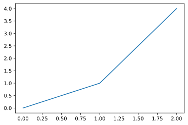

```python
import matplotlib.pyplot as plt
```


```python
plt.plot([0,1,2],[0,1,4])
```


    [<matplotlib.lines.Line2D at 0x7fa537eba700>]


    

    


```python
print("hello jupyter")
```

    hello jupyter

